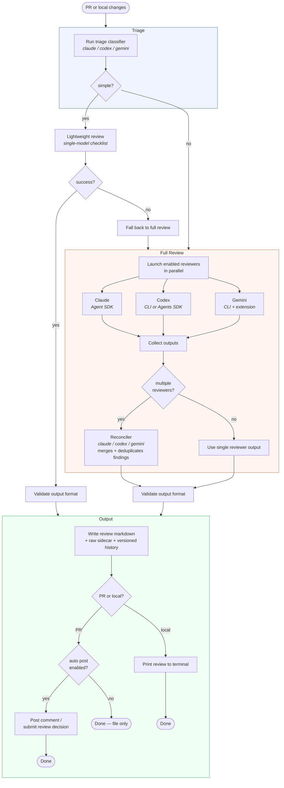

# code-reviewer

AI code review tool powered by Claude, Codex, and Gemini. Works as a GitHub PR daemon or as a local review tool for git repositories.

## Requirements

- Python 3.12+
- `uv`
- `gh` authenticated (`gh auth login`)
- `codex` authenticated
- `claude` authenticated (Agent SDK depends on Claude Code runtime)
- if using `gemini` reviewer: `gemini` authenticated + `code-review` extension installed
  (`gemini extensions install https://github.com/gemini-cli-extensions/code-review`)
- for `codex_backend = "agents_sdk"`: OpenAI Agents SDK package + `OPENAI_API_KEY`

## Setup

```bash
uv sync --extra dev
cp config.example.toml config.toml   # optional for run-once/review; required for check/start
```

## Commands

```bash
uv run code-reviewer check                  # preflight checks + runtime summary (requires config)
uv run code-reviewer run-once               # one polling cycle (requires config with github_orgs)
uv run code-reviewer start                  # daemon mode (requires config with github_orgs)
uv run code-reviewer review --uncommitted   # review local uncommitted changes (config optional)
uv run code-reviewer webhook                # GitHub App webhook server (env: WEBHOOK_SECRET)
```

> **Note:** `run-once --pr-url` and `review` work without a config file — sensible defaults are used.
> If `./config.toml` exists it is loaded automatically; pass `--config path.toml` to use a different file.

## Local Review

Review changes in any local git repository without GitHub:

```bash
# Review uncommitted changes (staged + unstaged) against HEAD
uv run code-reviewer review --uncommitted

# Compare branches
uv run code-reviewer review --base main
uv run code-reviewer review --base main --branch feature-x

# Review a specific commit
uv run code-reviewer review --commit abc1234

# Review a different repo
uv run code-reviewer review --repo /path/to/repo --uncommitted

# JSON output
uv run code-reviewer review --uncommitted --output-format json
```

All reviewer/model override flags work with `review` too:

```bash
uv run code-reviewer review --uncommitted --enabled-reviewer codex
uv run code-reviewer review --base main --reconciler-backend gemini
```

## PR Daemon

### Target specific PRs

```bash
uv run code-reviewer run-once --pr-url https://github.com/<org>/<repo>/pull/<number>
uv run code-reviewer run-once --pr-url https://github.com/<org>/<repo>/pull/<number> --auto-post-review
uv run code-reviewer run-once --pr-url https://github.com/<org>/<repo>/pull/<number> --use-saved-review --auto-post-review
uv run code-reviewer run-once --no-auto-post-review
```

### JSON output (requires --pr-url)

```bash
uv run code-reviewer run-once --pr-url https://github.com/<org>/<repo>/pull/<number> --output-format json
```

### Slash command trigger

The daemon monitors PR comments for `/review` commands:

- `/review` — request a review on the current PR
- `/review force` — force a re-review even if the current HEAD was already reviewed

**Who can trigger:** PR author and org members in monitored orgs.

**Behavior:**
- Reacts with 👀 to the triggering comment
- If already reviewed at the current commit: replies with a skip message (unless `force` is used)
- Runs the full review pipeline and posts results

## Configuration

### GitHub scope

```toml
github_orgs = ["Inkvi"]
# github_orgs = ["polymerdao", "another-org", "Inkvi"]
excluded_repos = ["polymerdao/infra", "sandbox-repo"]
```

### Reviewers

```toml
# Run both in parallel (default)
enabled_reviewers = ["claude", "codex"]

# Single reviewer
# enabled_reviewers = ["codex"]
# enabled_reviewers = ["claude"]
# enabled_reviewers = ["gemini"]
```

### Codex backend

```toml
# Stable default:
codex_backend = "cli"

# Experimental OpenAI Agents SDK backend:
# codex_backend = "agents_sdk"
```

### Model and reasoning tuning

```toml
# Claude
# claude_model = "claude-sonnet-4-5"
# claude_reasoning_effort = "low"    # low|medium|high|max

# Codex
codex_model = "gpt-5.3-codex"
codex_reasoning_effort = "low"       # low|medium|high

# Gemini
# gemini_model = "gemini-3.1-pro-preview"

# Reconciler (claude|codex|gemini)
reconciler_backend = "claude"
# reconciler_model = "claude-opus-4-1"
# reconciler_reasoning_effort = "high"    # claude: low|medium|high|max, codex: low|medium|high
```

### Triage and lightweight review

Every PR goes through triage first. Simple changes (config, version bumps, image tags) get a lightweight single-model checklist review. Complex changes go through the full multi-reviewer pipeline.

```toml
triage_backend = "gemini"              # claude|codex|gemini
triage_model = "gemini-3-flash-preview"
triage_timeout_seconds = 60

lightweight_review_backend = "gemini"  # claude|codex|gemini
lightweight_review_model = "gemini-3-flash-preview"
# lightweight_review_reasoning_effort = "low"   # low|medium|high|max
lightweight_review_timeout_seconds = 300
```

### Auto submission

```toml
# Post concise review as a normal PR comment
auto_post_review = false

# Submit formal review decision automatically:
# - approve when no P1/P2 findings
# - request changes when any P1/P2 finding exists
auto_submit_review_decision = false

# Post a comment when starting a review triggered by a re-request
post_rerequest_comment = true
```

### Trigger mode

```toml
trigger_mode = "rerequest_only"  # rerequest_only|rerequest_or_commit
```

### Output limits

```toml
max_findings = 10       # 1-20
max_test_gaps = 3       # 1-10
```

### Slash command

```toml
slash_command_enabled = true
```

### Other settings

```toml
poll_interval_seconds = 60
skip_own_prs = true
include_reviewer_stderr = true
max_parallel_prs = 1
max_mid_review_restarts = 2    # 0-5, restart review when new commits land mid-flight
claude_timeout_seconds = 900
codex_timeout_seconds = 900
gemini_timeout_seconds = 900
output_dir = "./reviews"
state_file = "./.state/pr-reviewer-state.json"
clone_root = "./.tmp/workspaces"
```

### CLI overrides

Most config fields can be overridden from the CLI:

```bash
uv run code-reviewer run-once --enabled-reviewer codex
uv run code-reviewer start --enabled-reviewer claude --enabled-reviewer codex
uv run code-reviewer run-once --codex-backend cli
uv run code-reviewer run-once --codex-model gpt-5.3-codex --codex-reasoning-effort high
uv run code-reviewer run-once --claude-model claude-sonnet-4-5 --claude-reasoning-effort medium
uv run code-reviewer run-once --reconciler-backend codex --reconciler-model gpt-5.3-codex
uv run code-reviewer run-once --reconciler-backend gemini --reconciler-model gemini-3.1-pro-preview
uv run code-reviewer start --slash-command-enabled
uv run code-reviewer start --no-slash-command-enabled
uv run code-reviewer run-once --triage-backend claude --triage-model claude-sonnet-4-5
uv run code-reviewer run-once --lightweight-review-backend claude
```

## Review Pipeline



## Webhook Server (GitHub App)

Run as a GitHub App webhook receiver instead of polling. The webhook server listens for PR events and spawns `run-once --pr-url` for each actionable event.

### Setup

1. Create a GitHub App with permissions: `pull_requests: write`, `issues: read`, `contents: read`
2. Subscribe to events: `pull_request`, `issue_comment`
3. Set the webhook URL to `https://<your-host>/webhook`
4. Note the webhook secret

### Run locally

```bash
WEBHOOK_SECRET=your-secret code-reviewer webhook
WEBHOOK_SECRET=your-secret code-reviewer webhook --host 127.0.0.1 --port 9090
```

### Environment variables

| Variable | Description | Default |
|----------|-------------|---------|
| `WEBHOOK_SECRET` | GitHub App webhook secret (recommended) | _(none, signature validation disabled)_ |
| `WEBHOOK_HOST` | Bind address | `0.0.0.0` |
| `WEBHOOK_PORT` | Bind port | `8000` |

### Endpoints

- `POST /webhook` — GitHub App webhook receiver
- `GET /healthz` — liveness probe

### Handled events

| Event | Action | Behavior |
|-------|--------|----------|
| `pull_request` | `opened`, `synchronize`, `review_requested` | Spawns review (skips drafts) |
| `issue_comment` | `created` with `/review` or `/review force` | Spawns review |
| `ping` | — | Returns pong |

## Docker

```bash
docker build -t code-reviewer .
docker run -e WEBHOOK_SECRET=your-secret -p 8000:8000 code-reviewer
```

The default entrypoint runs `code-reviewer webhook`. Override the command for other modes:

```bash
docker run code-reviewer run-once --pr-url https://github.com/org/repo/pull/123
docker run code-reviewer start
```

## Behavior

- Polls open PRs in all configured owners (`github_orgs`) where `review-requested:@me`
- Excludes repos listed in `excluded_repos`
- Runs only reviewers listed in `enabled_reviewers`
- Skips draft PRs and (by default) PRs authored by you
- Triages every PR as "simple" or "full_review"
- Simple PRs get a lightweight single-model checklist review
- Complex PRs go through the full multi-reviewer + reconciler pipeline
- If triage or lightweight review fails, falls back to full review
- Bootstraps all discovered candidate PRs when no prior state exists
- After bootstrap, processes PRs when a newer direct re-request is observed
- Runs all enabled reviewers in parallel
- Injects PR issue-thread comments into reconciliation context
- Writes reconciled review to `reviews/<org>/<repo>/pr-<number>.md`
- Writes versioned history to `reviews/<org>/<repo>/pr-<number>/<timestamp>-<shortsha>.md`
- Saves raw reviewer outputs to `reviews/<org>/<repo>/pr-<number>.raw.md`
- `run-once --pr-url ... --use-saved-review` reuses existing review and continues to posting/submission

## Lint and test

```bash
uv run ruff check .
uv run ruff format .
uv run pytest
```
